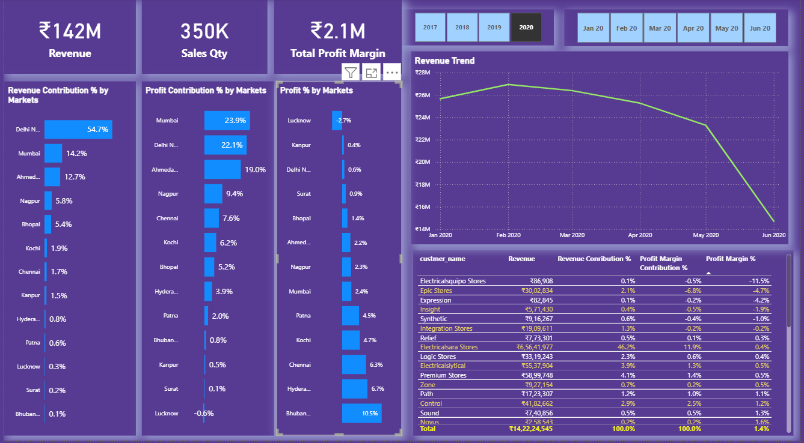

# 🎬 Sales Insights Analysis Project  :-

## 📌 Objective  -->>>>

To unlock sales insights that are not visible before for sales team for decision support and automate them to reduce manual time spent in data gathering. 

## 📊 Dataset  -->>>>

- <a href="https://github.com/dimple-shah-au13/Sales_Insights-/blob/main/SQL%20QUERIES/db_dump.sql">Dataset</a>

## 🔧 Tools & Libraries  -->>>>

- Python (Pandas, NumPy, Matplotlib, Seaborn)
- MySql (Database)
- Jupyter Notebook
- Power BI (for visualization dashboard)

## 📊 Power BI Dashboard Interaction -->>>>

- <a href="https://github.com/dimple-shah-au13/Sales_Insights-/blob/main/Images/Key_Insights.png">Key Insights</a>
- <a href="https://github.com/dimple-shah-au13/Sales_Insights-/blob/main/Images/Performance_Insights.png">Performance Insights</a>
- <a href="https://github.com/dimple-shah-au13/Sales_Insights-/blob/main/Images/Profit_Analysis.png">Profit Analysis</a>

## 📈 Exploratory Data Analysis -->>>>

- shows  total or sum of sales_amount
- shows total or sum of sales quantity
- shows which customer gave me how much revenue  or total sales_amount
- shows which customer gave me how much sales quantity
- track Revenue numbers by Year
- track Revenue numbers by Months also
- show total sales/ Revenue in year 2020 and month January
- Show total revenue in year 2020 in chennai
- Show Top 5 Customers with highest sales
- Show Top 5 Products
- Show revenue declining or increasing whatever
- show product cost and margin related transactions and detailed customer information
- show total Profit Margin Contribution
- Show Revenue contribution share of each region wise
- Top 5 customers with highest number of orders
- For which zone/zones I need to hire/fire sales managers (as performance is not upto mark)
  ( I want Dynamic Red Alert in the dashboard whenver performance of a certain zone /zones falls/fall below a certain mark )
- I want to hightlight or target the markets when the profit margin is less than the target exit (i.e -5%  --- Profit Target) 
  and we can create red alert to it.

## 📊 Power BI Dashboard  -->>>>

Here’s a preview of the interactive dashboard:

